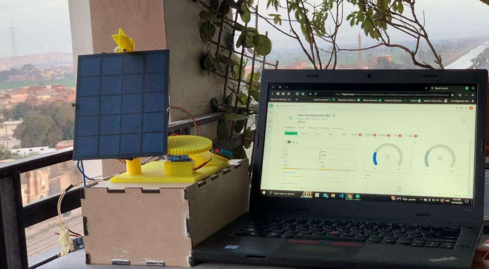
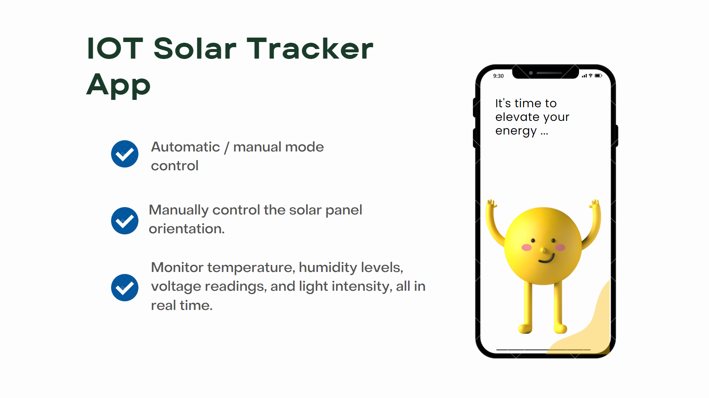
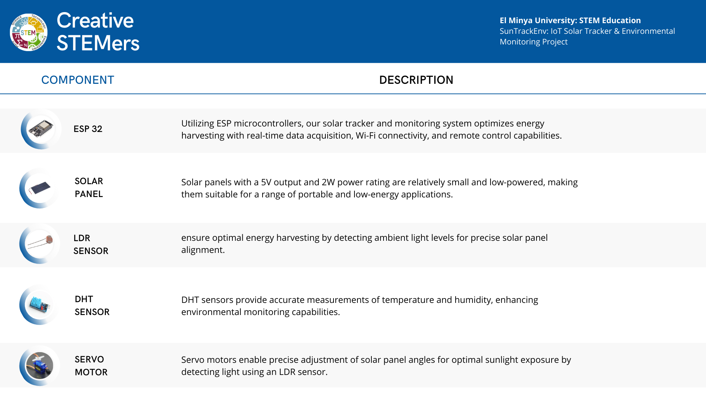
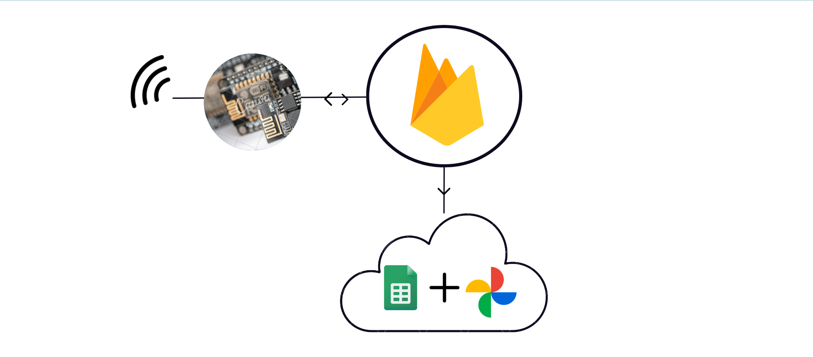

# SunTrackEnv

Welcome to SunTrackEnv, an advanced IoT project combining solar tracking technology with environmental monitoring capabilities. SunTrackEnv utilizes ESP32 microcontrollers to track the sun's position for optimal solar panel orientation while also monitoring environmental conditions such as temperature, humidity, and light levels. This project seamlessly integrates with the Blynk platform for remote monitoring and control, as well as Firebase and Google Sheets for data logging and analysis.

## Project Images

### App Features

*This image showcases the features of our SunTrackEnv mobile application, offering real-time monitoring and control of solar tracking parameters, environmental data visualization, and seamless integration with the Blynk platform for remote access.*

### Components

*In this image, you'll find the components utilized in our SunTrackEnv project. From ESP32 microcontrollers and solar panels to sensors like DHT11, LDR, and SG90 servo motors, each component plays a vital role in enabling solar tracking and environmental monitoring functionalities.*

### Data Logging Graph

*The graph displayed here illustrates the data logging capabilities of SunTrackEnv, providing insights into temperature, humidity, and light levels over time. This data logging feature, integrated with Firebase and Google Sheets, enables comprehensive analysis and optimization of solar tracking performance.*

---

## Features

- Solar tracking technology for optimal solar panel orientation.
- Environmental monitoring of temperature, humidity, and light levels.
- Integration with the Blynk platform for real-time data visualization and control.
- Data logging and analysis using Firebase and Google Sheets.

---

## Getting Started

To get started with SunTrackEnv, follow these steps:

### Hardware Setup

Connect your ESP32 microcontroller to the appropriate sensors and actuators for solar tracking and environmental monitoring.

### Blynk Setup

1. Set up a Blynk account and create a new project.
2. Configure the Blynk app with widgets to visualize and control your project's data.

### Firebase Setup

1. Set up a Firebase account and create a new project.
2. Configure Firebase Realtime Database or Firestore for data logging.

### Google Sheets Setup

1. Set up a Google Sheets account and create a new spreadsheet.
2. Configure Google Sheets API for data logging.

### Installation

1. Clone this repository to your local machine using `git clone`.
2. Open the project in your preferred Arduino IDE.

### Configuration

Update the `auth.h` file with your Blynk authentication token and other credentials as needed.

### Upload

Upload the project code to your ESP32 microcontroller.

### Usage

Monitor solar tracking and environmental conditions using the Blynk mobile app. View and analyze logged data using Firebase and Google Sheets.

## Contributors

- Noury Hazem - [GitHub Profile](https://github.com/Nouryhazem)

## License

This project is licensed under the MIT License - see the [LICENSE](LICENSE) file for details.
